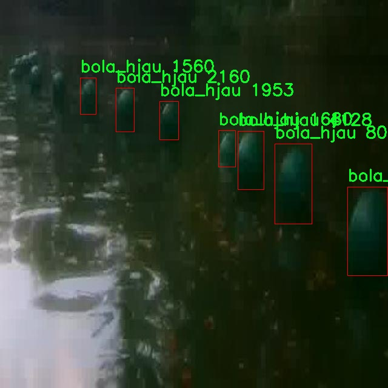

# 水上浮球定位检测系统源码分享
 # [一条龙教学YOLOV8标注好的数据集一键训练_70+全套改进创新点发刊_Web前端展示]

### 1.研究背景与意义

项目参考[AAAI Association for the Advancement of Artificial Intelligence](https://gitee.com/qunshansj/projects)

项目来源[AACV Association for the Advancement of Computer Vision](https://gitee.com/qunmasj/projects)

研究背景与意义

随着水上运动和水上活动的普及，水上浮球的定位与识别在安全管理、赛事组织以及环境监测等领域变得愈发重要。水上浮球作为水域标识的重要工具，其准确定位不仅有助于提高水上活动的安全性，还能为水域环境保护提供数据支持。传统的浮球定位方法多依赖人工观察或简单的视觉识别，效率低下且易受环境因素的影响。因此，基于计算机视觉的自动化浮球定位系统应运而生，成为提升水上浮球管理效率的重要手段。

近年来，深度学习技术的迅猛发展为目标检测领域带来了革命性的变化，尤其是YOLO（You Only Look Once）系列模型在实时目标检测任务中表现出色。YOLOv8作为该系列的最新版本，凭借其高效的特征提取能力和实时处理能力，成为了浮球定位系统的理想选择。然而，YOLOv8在特定环境下的适应性和准确性仍有待提高，尤其是在复杂水面背景和不同光照条件下，浮球的颜色和形状特征可能会受到干扰。因此，改进YOLOv8模型以增强其在水上浮球定位中的性能，具有重要的研究意义。

本研究将基于改进YOLOv8模型，构建一个高效的水上浮球定位系统。我们将使用一个包含1600张图像的数据集，该数据集涵盖了三种类别的浮球：绿色浮球（bola_hijau）、黄色浮球（bola_hjau）和红色浮球（bola_merah）。这些图像数据不仅提供了丰富的样本，还涵盖了不同的水面背景和光照条件，为模型的训练和测试提供了良好的基础。通过对这些图像的分析，我们可以提取出浮球的颜色、形状和位置等特征，从而为后续的模型改进提供数据支持。

改进YOLOv8模型的意义在于，不仅可以提高浮球的检测精度，还能增强其在复杂环境下的鲁棒性。通过引入数据增强技术、优化网络结构以及调整超参数，我们期望能够提升模型在实际应用中的表现。这一研究不仅能够为水上浮球的自动化定位提供技术支持，还将推动计算机视觉技术在水上活动安全管理中的应用。

此外，本研究的成果将为后续相关领域的研究提供借鉴。随着智能化技术的不断发展，基于深度学习的目标检测方法在环境监测、交通管理、公共安全等领域的应用前景广阔。通过对水上浮球定位系统的研究，我们可以探索深度学习在其他水域标识物、环境监测设备等方面的应用潜力，为实现更广泛的智能化管理提供理论依据和技术支持。

综上所述，基于改进YOLOv8的水上浮球定位系统的研究，不仅具有重要的学术价值和应用前景，也为推动智能化水上活动管理提供了新的思路和方法。通过这一研究，我们希望能够为水上活动的安全管理和环境保护贡献一份力量。

### 2.图片演示


##### 注意：由于此博客编辑较早，上面“2.图片演示”和“3.视频演示”展示的系统图片或者视频可能为老版本，新版本在老版本的基础上升级如下：（实际效果以升级的新版本为准）

  （1）适配了YOLOV8的“目标检测”模型和“实例分割”模型，通过加载相应的权重（.pt）文件即可自适应加载模型。

  （2）支持“图片识别”、“视频识别”、“摄像头实时识别”三种识别模式。

  （3）支持“图片识别”、“视频识别”、“摄像头实时识别”三种识别结果保存导出，解决手动导出（容易卡顿出现爆内存）存在的问题，识别完自动保存结果并导出到tempDir中。

  （4）支持Web前端系统中的标题、背景图等自定义修改，后面提供修改教程。

  另外本项目提供训练的数据集和训练教程,暂不提供权重文件（best.pt）,需要您按照教程进行训练后实现图片演示和Web前端界面演示的效果。

### 3.视频演示

[3.1 视频演示](https://www.bilibili.com/video/BV1kh4EeUE3k/)

### 4.数据集信息展示

##### 4.1 本项目数据集详细数据（类别数＆类别名）

nc: 3
names: ['bola_hijau', 'bola_hjau', 'bola_merah']


##### 4.2 本项目数据集信息介绍

数据集信息展示

在现代计算机视觉领域，数据集的构建与应用至关重要，尤其是在目标检测任务中。为了提升YOLOv8在水上浮球定位系统中的性能，我们构建了一个名为“BOLA”的数据集。该数据集专注于水上浮球的检测与识别，包含了三种不同类型的浮球，分别是“bola_hijau”（绿色浮球）、“bola_hjau”（黄色浮球）和“bola_merah”（红色浮球）。这些类别的选择不仅考虑了浮球在实际应用中的多样性，还旨在为算法的训练提供丰富的样本，以提高其在复杂环境下的鲁棒性。

“BOLA”数据集的构建过程经过了精心设计，确保了数据的多样性和代表性。数据集中的图像采集自不同的水域环境，包括湖泊、河流和海洋等，涵盖了不同的光照条件、天气变化以及水面波动等因素。这种多样性使得训练出的模型能够更好地适应现实世界中的各种情况，从而提升其在实际应用中的有效性和可靠性。

在数据标注方面，我们采用了精确的标注技术，确保每个浮球的边界框和类别信息的准确性。每张图像都经过专业标注人员的审核，以确保数据的高质量。这种高质量的数据标注不仅为YOLOv8模型的训练提供了坚实的基础，也为后续的模型评估和性能分析提供了可靠的数据支持。

此外，为了增强模型的泛化能力，我们在数据集中引入了数据增强技术。这包括图像的旋转、缩放、裁剪、颜色变换等操作，使得模型在训练过程中能够接触到更多样化的样本。这种策略不仅增加了数据集的有效样本数量，还提高了模型对不同场景的适应能力，减少了过拟合的风险。

在“BOLA”数据集中，每个类别的样本数量经过精心设计，以确保类别之间的平衡。通过对每种浮球类型的均衡采样，我们能够有效地避免模型在训练过程中对某一类别的偏向，从而提高整体检测性能。数据集的类别数量和名称信息清晰明了，使得研究人员和开发者能够快速理解数据集的结构和内容。

总之，“BOLA”数据集的构建不仅为改进YOLOv8的水上浮球定位系统提供了强有力的支持，也为未来相关研究提供了宝贵的资源。通过对数据集的深入分析和应用，我们期待能够推动水上浮球检测技术的发展，为实际应用场景中的浮球监测和管理提供更为精准和高效的解决方案。随着技术的不断进步，我们相信“BOLA”数据集将在目标检测领域发挥越来越重要的作用，助力更多创新应用的实现。





### 5.全套项目环境部署视频教程（零基础手把手教学）

[5.1 环境部署教程链接（零基础手把手教学）](https://www.ixigua.com/7404473917358506534?logTag=c807d0cbc21c0ef59de5)


[5.2 安装Python虚拟环境创建和依赖库安装视频教程链接（零基础手把手教学）](https://www.ixigua.com/7404474678003106304?logTag=1f1041108cd1f708b01a)

### 6.手把手YOLOV8训练视频教程（零基础小白有手就能学会）

[6.1 手把手YOLOV8训练视频教程（零基础小白有手就能学会）](https://www.ixigua.com/7404477157818401292?logTag=d31a2dfd1983c9668658)

### 7.70+种全套YOLOV8创新点代码加载调参视频教程（一键加载写好的改进模型的配置文件）

[7.1 70+种全套YOLOV8创新点代码加载调参视频教程（一键加载写好的改进模型的配置文件）](https://www.ixigua.com/7404478314661806627?logTag=29066f8288e3f4eea3a4)

### 8.70+种全套YOLOV8创新点原理讲解（非科班也可以轻松写刊发刊，V10版本正在科研待更新）

由于篇幅限制，每个创新点的具体原理讲解就不一一展开，具体见下列网址中的创新点对应子项目的技术原理博客网址【Blog】：


[8.1 70+种全套YOLOV8创新点原理讲解链接](https://gitee.com/qunmasj/good)

### 9.系统功能展示（检测对象为举例，实际内容以本项目数据集为准）

图9.1.系统支持检测结果表格显示

  图9.2.系统支持置信度和IOU阈值手动调节

  图9.3.系统支持自定义加载权重文件best.pt(需要你通过步骤5中训练获得)

  图9.4.系统支持摄像头实时识别

  图9.5.系统支持图片识别

  图9.6.系统支持视频识别

  图9.7.系统支持识别结果文件自动保存

  图9.8.系统支持Excel导出检测结果数据


### 10.原始YOLOV8算法原理

原始YOLOv8算法原理

YOLOv8是Ultralytics公司于2023年发布的最新目标检测算法，作为YOLO系列的又一重要里程碑，它在前几代算法的基础上进行了多项创新和改进，旨在提升目标检测的准确性和效率。YOLOv8的架构设计围绕着快速、准确和易于使用的理念，广泛适用于目标检测、图像分割和图像分类等任务。该算法的核心在于其网络结构的设计，包括输入层、主干网络、颈部网络和检测头等部分。

在输入层，YOLOv8默认接收640x640像素的图像，但考虑到实际应用中图像长宽比的多样性，YOLOv8采用自适应图片缩放策略。这一策略通过将图像的长边按比例缩小到指定尺寸，然后对短边进行填充，尽量减少信息冗余，提升目标检测和推理的速度。此外，在训练过程中，YOLOv8引入了Mosaic图像增强技术，该技术通过随机拼接四张不同的图像生成新的训练样本，从而迫使模型学习不同位置和周围像素的特征，显著提高了模型的预测精度。

YOLOv8的主干网络采用了CSP（Cross Stage Partial）结构，具体使用了C2f模块来替代YOLOv5中的C3模块。C2f模块的设计灵感来源于YOLOv7中的ELAN模块，其结构通过并行化更多的梯度流分支，既保持了模型的轻量化，又增强了梯度信息的丰富性。这种设计使得YOLOv8在特征提取的过程中能够更有效地捕捉到多样化的特征，从而提高了检测精度。

在颈部网络部分，YOLOv8继续采用PAN-FPN（Path Aggregation Network - Feature Pyramid Network）结构，但进行了优化，去除了上采样前的1x1卷积连接层，直接对主干网络不同阶段输出的特征进行上采样。这一改进使得特征融合更加高效，减少了计算复杂度，同时保持了多尺度特征的有效性。

YOLOv8在检测头部分的创新尤为显著。它采用了解耦合头结构，将目标检测和分类任务分开处理。与YOLOv5的耦合头结构不同，YOLOv8的解耦头通过两个1x1卷积模块分别处理类别预测和边界框回归，这种分离使得模型在处理复杂场景时能够更灵活地进行特征学习。此外，YOLOv8抛弃了传统的Anchor-Based方法，转而采用Anchor-Free的检测方式。这一转变使得YOLOv8在目标检测时不再依赖于预设的锚框，而是将目标检测转化为关键点检测，从而简化了模型结构，提升了泛化能力。

在损失函数的设计上，YOLOv8也进行了重要的改进。它在分类分支中继续使用二值交叉熵损失（BCELoss），而在边界框回归分支中则采用了分布焦点损失（DFL）和CIoU损失的组合。这种损失函数的设计旨在使模型更快地聚焦于标签附近的数值，从而提高了检测的准确性。

综上所述，YOLOv8通过对网络结构的多项创新和优化，提升了目标检测的性能和灵活性。其在特征提取、特征融合、检测方式及损失函数等方面的改进，使得YOLOv8在各种目标检测任务中展现出卓越的表现，成为了当前目标检测领域的一个重要工具。随着YOLOv8的推出，研究人员和开发者们可以更高效地进行目标检测任务，为实际应用提供了更为强大的支持。


### 11.项目核心源码讲解（再也不用担心看不懂代码逻辑）

#### 11.1 70+种YOLOv8算法改进源码大全和调试加载训练教程（非必要）\ultralytics\nn\extra_modules\dynamic_snake_conv.py

以下是对给定代码的核心部分进行分析和详细注释的结果。保留了主要的类和方法，去掉了一些冗余的部分。

```python
import torch
import torch.nn as nn
from ..modules.conv import Conv

__all__ = ['DySnakeConv']

class DySnakeConv(nn.Module):
    def __init__(self, inc, ouc, k=3) -> None:
        """
        动态蛇形卷积的构造函数
        :param inc: 输入通道数
        :param ouc: 输出通道数
        :param k: 卷积核大小，默认为3
        """
        super().__init__()
        
        # 定义三个卷积层
        self.conv_0 = Conv(inc, ouc, k)  # 标准卷积
        self.conv_x = DSConv(inc, ouc, 0, k)  # 沿x轴的动态蛇形卷积
        self.conv_y = DSConv(inc, ouc, 1, k)  # 沿y轴的动态蛇形卷积
    
    def forward(self, x):
        """
        前向传播函数
        :param x: 输入特征图
        :return: 拼接后的输出特征图
        """
        # 将三个卷积的输出在通道维度上拼接
        return torch.cat([self.conv_0(x), self.conv_x(x), self.conv_y(x)], dim=1)

class DSConv(nn.Module):
    def __init__(self, in_ch, out_ch, morph, kernel_size=3, if_offset=True, extend_scope=1):
        """
        动态蛇形卷积的构造函数
        :param in_ch: 输入通道数
        :param out_ch: 输出通道数
        :param morph: 卷积核的形态，0表示沿x轴，1表示沿y轴
        :param kernel_size: 卷积核大小
        :param if_offset: 是否需要偏移
        :param extend_scope: 扩展范围
        """
        super(DSConv, self).__init__()
        # 用于学习可变形偏移的卷积层
        self.offset_conv = nn.Conv2d(in_ch, 2 * kernel_size, 3, padding=1)
        self.bn = nn.BatchNorm2d(2 * kernel_size)  # 批归一化
        self.kernel_size = kernel_size

        # 定义沿x轴和y轴的动态蛇形卷积
        self.dsc_conv_x = nn.Conv2d(
            in_ch,
            out_ch,
            kernel_size=(kernel_size, 1),
            stride=(kernel_size, 1),
            padding=0,
        )
        self.dsc_conv_y = nn.Conv2d(
            in_ch,
            out_ch,
            kernel_size=(1, kernel_size),
            stride=(1, kernel_size),
            padding=0,
        )

        self.gn = nn.GroupNorm(out_ch // 4, out_ch)  # 组归一化
        self.act = Conv.default_act  # 默认激活函数

        self.extend_scope = extend_scope
        self.morph = morph
        self.if_offset = if_offset

    def forward(self, f):
        """
        前向传播函数
        :param f: 输入特征图
        :return: 经过动态蛇形卷积后的特征图
        """
        # 计算偏移
        offset = self.offset_conv(f)
        offset = self.bn(offset)
        offset = torch.tanh(offset)  # 将偏移限制在[-1, 1]之间

        # 获取输入特征图的形状
        input_shape = f.shape
        dsc = DSC(input_shape, self.kernel_size, self.extend_scope, self.morph)  # 创建DSC对象
        deformed_feature = dsc.deform_conv(f, offset, self.if_offset)  # 进行可变形卷积

        # 根据形态选择对应的卷积操作
        if self.morph == 0:
            x = self.dsc_conv_x(deformed_feature.type(f.dtype))
        else:
            x = self.dsc_conv_y(deformed_feature.type(f.dtype))
        
        x = self.gn(x)  # 归一化
        x = self.act(x)  # 激活
        return x

class DSC(object):
    def __init__(self, input_shape, kernel_size, extend_scope, morph):
        """
        动态蛇形卷积的坐标变换和双线性插值的辅助类
        :param input_shape: 输入特征图的形状
        :param kernel_size: 卷积核大小
        :param extend_scope: 扩展范围
        :param morph: 卷积核的形态
        """
        self.num_points = kernel_size
        self.width = input_shape[2]
        self.height = input_shape[3]
        self.morph = morph
        self.extend_scope = extend_scope

        # 定义特征图的形状
        self.num_batch = input_shape[0]
        self.num_channels = input_shape[1]

    def deform_conv(self, input, offset, if_offset):
        """
        进行可变形卷积
        :param input: 输入特征图
        :param offset: 偏移量
        :param if_offset: 是否需要偏移
        :return: 变形后的特征图
        """
        y, x = self._coordinate_map_3D(offset, if_offset)  # 计算坐标映射
        deformed_feature = self._bilinear_interpolate_3D(input, y, x)  # 进行双线性插值
        return deformed_feature

    def _coordinate_map_3D(self, offset, if_offset):
        """
        计算3D坐标映射
        :param offset: 偏移量
        :param if_offset: 是否需要偏移
        :return: y和x的坐标映射
        """
        # 省略具体实现细节
        pass

    def _bilinear_interpolate_3D(self, input_feature, y, x):
        """
        进行3D双线性插值
        :param input_feature: 输入特征图
        :param y: y坐标映射
        :param x: x坐标映射
        :return: 插值后的特征图
        """
        # 省略具体实现细节
        pass
```

### 代码分析
1. **DySnakeConv 类**: 这是动态蛇形卷积的主要类，包含了三个卷积层：标准卷积和两个动态蛇形卷积（分别沿x轴和y轴）。在前向传播中，将这三个卷积的输出在通道维度上拼接。

2. **DSConv 类**: 这个类实现了动态蛇形卷积的具体操作。它通过一个卷积层学习偏移量，并根据偏移量进行特征图的变形。前向传播中，首先计算偏移量，然后根据偏移量和输入特征图进行可变形卷积。

3. **DSC 类**: 这是一个辅助类，负责处理坐标映射和双线性插值。它的主要功能是根据偏移量计算新的坐标，并在这些坐标上进行插值，以获得变形后的特征图。

### 总结
该代码实现了一个动态蛇形卷积的神经网络模块，具有灵活的卷积核形态和可变形的特征提取能力，适用于处理复杂的图像特征。

这个文件实现了动态蛇形卷积（Dynamic Snake Convolution）的一种神经网络模块，主要由两个类构成：`DySnakeConv` 和 `DSConv`，以及一个辅助类 `DSC`。这些模块的设计目的是为了增强卷积操作的灵活性和适应性，使得卷积核能够根据输入特征图的内容进行动态调整，从而提升模型的表现。

在 `DySnakeConv` 类中，构造函数初始化了三个卷积层：`conv_0` 是标准卷积，`conv_x` 和 `conv_y` 是动态蛇形卷积的两个变体，分别沿着 x 轴和 y 轴进行卷积操作。在前向传播中，输入特征图 `x` 会通过这三个卷积层处理，最后将它们的输出在通道维度上进行拼接。

`DSConv` 类实现了动态蛇形卷积的具体逻辑。它的构造函数接受输入通道数、输出通道数、卷积核大小等参数，并初始化了用于学习偏移量的卷积层 `offset_conv`，以及两个不同方向的卷积层 `dsc_conv_x` 和 `dsc_conv_y`。在前向传播中，首先通过 `offset_conv` 计算出偏移量，然后利用这些偏移量对输入特征图进行变形卷积，最后根据不同的形态（x 轴或 y 轴）选择相应的卷积层进行处理。

`DSC` 类则是实现了变形卷积的核心逻辑。它负责生成坐标映射和进行双线性插值。具体来说，`_coordinate_map_3D` 方法根据偏移量生成新的坐标映射，`_bilinear_interpolate_3D` 方法则利用这些坐标进行双线性插值，从而得到变形后的特征图。这个过程允许卷积核在输入特征图上进行非均匀的采样，从而更好地捕捉到特征的变化。

整体来看，这个文件的设计通过引入动态的卷积核偏移，增强了卷积操作的灵活性，使得模型能够更好地适应复杂的输入数据。这种方法在计算机视觉任务中，尤其是在目标检测和图像分割等领域，可能会带来显著的性能提升。

#### 11.2 code\ultralytics\nn\modules\transformer.py

以下是代码中最核心的部分，并附上详细的中文注释：

```python
import torch
import torch.nn as nn
import torch.nn.functional as F

class TransformerEncoderLayer(nn.Module):
    """定义一个变换器编码器层。"""

    def __init__(self, c1, cm=2048, num_heads=8, dropout=0.0, act=nn.GELU(), normalize_before=False):
        """初始化变换器编码器层，设置参数。"""
        super().__init__()
        self.ma = nn.MultiheadAttention(c1, num_heads, dropout=dropout, batch_first=True)  # 多头自注意力机制
        self.fc1 = nn.Linear(c1, cm)  # 第一个全连接层
        self.fc2 = nn.Linear(cm, c1)  # 第二个全连接层
        self.norm1 = nn.LayerNorm(c1)  # 第一层归一化
        self.norm2 = nn.LayerNorm(c1)  # 第二层归一化
        self.dropout = nn.Dropout(dropout)  # dropout层
        self.dropout1 = nn.Dropout(dropout)  # dropout层1
        self.dropout2 = nn.Dropout(dropout)  # dropout层2
        self.act = act  # 激活函数
        self.normalize_before = normalize_before  # 是否在前面进行归一化

    def forward(self, src, src_mask=None, src_key_padding_mask=None, pos=None):
        """通过编码器模块进行前向传播。"""
        if self.normalize_before:
            return self.forward_pre(src, src_mask, src_key_padding_mask, pos)  # 前归一化
        return self.forward_post(src, src_mask, src_key_padding_mask, pos)  # 后归一化

    def forward_post(self, src, src_mask=None, src_key_padding_mask=None, pos=None):
        """后归一化的前向传播。"""
        q = k = self.with_pos_embed(src, pos)  # 计算查询和键
        src2 = self.ma(q, k, value=src, attn_mask=src_mask, key_padding_mask=src_key_padding_mask)[0]  # 自注意力计算
        src = src + self.dropout1(src2)  # 残差连接
        src = self.norm1(src)  # 归一化
        src2 = self.fc2(self.dropout(self.act(self.fc1(src))))  # 前馈网络
        src = src + self.dropout2(src2)  # 残差连接
        return self.norm2(src)  # 归一化

    def forward_pre(self, src, src_mask=None, src_key_padding_mask=None, pos=None):
        """前归一化的前向传播。"""
        src2 = self.norm1(src)  # 先进行归一化
        q = k = self.with_pos_embed(src2, pos)  # 计算查询和键
        src2 = self.ma(q, k, value=src2, attn_mask=src_mask, key_padding_mask=src_key_padding_mask)[0]  # 自注意力计算
        src = src + self.dropout1(src2)  # 残差连接
        src2 = self.norm2(src)  # 归一化
        src2 = self.fc2(self.dropout(self.act(self.fc1(src2))))  # 前馈网络
        return src + self.dropout2(src2)  # 残差连接

    @staticmethod
    def with_pos_embed(tensor, pos=None):
        """如果提供了位置嵌入，则将其添加到张量中。"""
        return tensor if pos is None else tensor + pos  # 返回加上位置嵌入的张量


class DeformableTransformerDecoderLayer(nn.Module):
    """可变形变换器解码器层。"""

    def __init__(self, d_model=256, n_heads=8, d_ffn=1024, dropout=0.0, act=nn.ReLU(), n_levels=4, n_points=4):
        """初始化可变形变换器解码器层。"""
        super().__init__()
        self.self_attn = nn.MultiheadAttention(d_model, n_heads, dropout=dropout)  # 自注意力机制
        self.dropout1 = nn.Dropout(dropout)  # dropout层1
        self.norm1 = nn.LayerNorm(d_model)  # 归一化层1
        self.cross_attn = MSDeformAttn(d_model, n_levels, n_heads, n_points)  # 跨注意力机制
        self.dropout2 = nn.Dropout(dropout)  # dropout层2
        self.norm2 = nn.LayerNorm(d_model)  # 归一化层2
        self.linear1 = nn.Linear(d_model, d_ffn)  # 前馈网络的第一个全连接层
        self.act = act  # 激活函数
        self.dropout3 = nn.Dropout(dropout)  # dropout层3
        self.linear2 = nn.Linear(d_ffn, d_model)  # 前馈网络的第二个全连接层
        self.dropout4 = nn.Dropout(dropout)  # dropout层4
        self.norm3 = nn.LayerNorm(d_model)  # 归一化层3

    def forward(self, embed, refer_bbox, feats, shapes, padding_mask=None, attn_mask=None, query_pos=None):
        """通过整个解码器层进行前向传播。"""
        # 自注意力
        q = k = self.with_pos_embed(embed, query_pos)  # 计算查询和键
        tgt = self.self_attn(q.transpose(0, 1), k.transpose(0, 1), embed.transpose(0, 1), attn_mask=attn_mask)[0].transpose(0, 1)  # 自注意力计算
        embed = embed + self.dropout1(tgt)  # 残差连接
        embed = self.norm1(embed)  # 归一化

        # 跨注意力
        tgt = self.cross_attn(self.with_pos_embed(embed, query_pos), refer_bbox.unsqueeze(2), feats, shapes, padding_mask)  # 跨注意力计算
        embed = embed + self.dropout2(tgt)  # 残差连接
        embed = self.norm2(embed)  # 归一化

        # 前馈网络
        tgt2 = self.linear2(self.dropout3(self.act(self.linear1(embed))))  # 前馈网络计算
        embed = embed + self.dropout4(tgt2)  # 残差连接
        return self.norm3(embed)  # 归一化

    @staticmethod
    def with_pos_embed(tensor, pos):
        """如果提供了位置嵌入，则将其添加到输入张量中。"""
        return tensor if pos is None else tensor + pos  # 返回加上位置嵌入的张量
```

### 代码核心部分说明：
1. **TransformerEncoderLayer**: 这是变换器编码器的核心模块，包含自注意力机制和前馈网络。支持前后归一化的选项，能够处理输入数据并生成编码后的输出。

2. **DeformableTransformerDecoderLayer**: 这是可变形变换器解码器的核心模块，包含自注意力和跨注意力机制，能够根据输入的特征和参考边界框生成解码后的输出。

这两个类是实现变换器模型的基础，负责处理输入数据的编码和解码过程。

这个程序文件定义了一些与Transformer相关的模块，主要用于构建深度学习模型，特别是在计算机视觉任务中，如目标检测等。文件中包含多个类，每个类实现了不同的功能。

首先，`TransformerEncoderLayer`类定义了Transformer编码器的单层结构。它使用多头自注意力机制来处理输入数据，并通过前馈神经网络进行进一步的特征变换。该类支持前后归一化的两种模式，允许用户根据需求选择使用哪种方式。它还实现了位置嵌入的添加功能，以增强模型对输入序列中元素位置的感知。

接下来，`AIFI`类是`TransformerEncoderLayer`的一个子类，专门用于处理二维输入数据。它通过构建二维正弦余弦位置嵌入来增强模型的空间特征学习能力，并在前向传播中处理输入数据的形状转换。

`TransformerLayer`类实现了一个简单的Transformer层，包含自注意力机制和前馈网络。它通过线性变换来生成查询、键和值，并通过多头注意力机制进行特征提取。

`TransformerBlock`类则将多个`TransformerLayer`组合在一起，形成一个完整的Transformer模块。它还可以根据需要应用卷积操作，以调整输入特征的维度。

`MLPBlock`和`MLP`类实现了多层感知机（MLP），用于对特征进行非线性变换。`MLPBlock`定义了一个单独的MLP块，而`MLP`则实现了整个多层感知机的结构。

`LayerNorm2d`类实现了二维层归一化，用于在处理图像数据时进行归一化操作，以提高模型的训练稳定性和收敛速度。

`MSDeformAttn`类实现了多尺度可变形注意力机制，能够在不同尺度上对输入特征进行自适应处理，增强模型对复杂场景的理解能力。

`DeformableTransformerDecoderLayer`和`DeformableTransformerDecoder`类实现了可变形Transformer解码器的结构，支持自注意力和交叉注意力机制，能够在解码过程中结合参考边界框信息，以提高目标检测的精度。

总体而言，这个文件实现了多个与Transformer相关的模块，提供了灵活的结构和功能，适用于各种计算机视觉任务，尤其是在目标检测等领域。通过这些模块，用户可以构建复杂的深度学习模型，以处理不同类型的输入数据并进行有效的特征学习。

#### 11.3 ui.py

```python
import sys
import subprocess

def run_script(script_path):
    """
    使用当前 Python 环境运行指定的脚本。

    Args:
        script_path (str): 要运行的脚本路径

    Returns:
        None
    """
    # 获取当前 Python 解释器的路径
    python_path = sys.executable

    # 构建运行命令，使用 streamlit 运行指定的脚本
    command = f'"{python_path}" -m streamlit run "{script_path}"'

    # 执行命令
    result = subprocess.run(command, shell=True)
    # 检查命令执行结果，如果返回码不为0，则表示出错
    if result.returncode != 0:
        print("脚本运行出错。")

# 实例化并运行应用
if __name__ == "__main__":
    # 指定要运行的脚本路径
    script_path = "web.py"  # 这里可以替换为实际的脚本路径

    # 调用函数运行脚本
    run_script(script_path)
```

### 代码注释说明：
1. **导入模块**：
   - `sys`：用于获取当前 Python 解释器的路径。
   - `subprocess`：用于执行外部命令。

2. **定义 `run_script` 函数**：
   - 接受一个参数 `script_path`，表示要运行的 Python 脚本的路径。
   - 使用 `sys.executable` 获取当前 Python 解释器的路径，以便后续执行命令时使用。
   - 构建一个命令字符串，使用 `streamlit` 模块运行指定的脚本。
   - 使用 `subprocess.run` 执行构建的命令，并将 `shell` 参数设置为 `True`，以便在 shell 中运行命令。
   - 检查命令的返回码，如果返回码不为0，表示脚本运行出错，打印错误信息。

3. **主程序入口**：
   - 在 `if __name__ == "__main__":` 块中，指定要运行的脚本路径（这里使用的是 `web.py`）。
   - 调用 `run_script` 函数，传入脚本路径以执行该脚本。

这个程序文件名为 `ui.py`，主要功能是使用当前的 Python 环境来运行一个指定的脚本，具体是通过 Streamlit 框架来启动一个 Web 应用。

首先，程序导入了必要的模块，包括 `sys`、`os` 和 `subprocess`。其中，`sys` 模块用于访问与 Python 解释器相关的变量和函数，`os` 模块提供了与操作系统交互的功能，而 `subprocess` 模块则用于创建新进程、连接到它们的输入/输出/错误管道，并获取它们的返回码。此外，程序还从 `QtFusion.path` 导入了 `abs_path` 函数，用于获取文件的绝对路径。

接下来，定义了一个名为 `run_script` 的函数，该函数接受一个参数 `script_path`，表示要运行的脚本的路径。在函数内部，首先获取当前 Python 解释器的路径，存储在 `python_path` 变量中。然后，构建一个命令字符串 `command`，该命令使用当前的 Python 解释器和 Streamlit 模块来运行指定的脚本。命令的格式为 `"{python_path}" -m streamlit run "{script_path}"`。

随后，使用 `subprocess.run` 方法执行构建好的命令，并将 `shell` 参数设置为 `True`，以便在 shell 中运行该命令。执行完命令后，检查返回码 `result.returncode`，如果返回码不为 0，表示脚本运行出错，则打印一条错误信息。

最后，在 `if __name__ == "__main__":` 块中，程序指定了要运行的脚本路径，这里使用 `abs_path("web.py")` 来获取 `web.py` 的绝对路径。然后调用 `run_script` 函数来运行这个脚本。

总体来说，这个程序的主要作用是方便地启动一个基于 Streamlit 的 Web 应用，确保在正确的 Python 环境中运行指定的脚本。

#### 11.4 70+种YOLOv8算法改进源码大全和调试加载训练教程（非必要）\ultralytics\hub\auth.py

以下是代码中最核心的部分，并附上详细的中文注释：

```python
import requests  # 导入requests库用于发送HTTP请求

# 定义API的根地址
HUB_API_ROOT = 'https://api.example.com'  # 示例API根地址
HUB_WEB_ROOT = 'https://web.example.com'  # 示例Web根地址
PREFIX = '[Auth]'  # 日志前缀

class Auth:
    """
    处理身份验证过程，包括API密钥处理、基于cookie的身份验证和头部生成。

    支持不同的身份验证方法：
    1. 直接使用API密钥。
    2. 使用浏览器cookie进行身份验证（特别是在Google Colab中）。
    3. 提示用户输入API密钥。
    """
    id_token = api_key = model_key = False  # 初始化身份验证相关的属性

    def __init__(self, api_key='', verbose=False):
        """
        初始化Auth类，接受一个可选的API密钥。

        参数：
            api_key (str, optional): 可能是API密钥或组合的API密钥和模型ID。
        """
        # 分割输入的API密钥，以防包含组合的key_model，只保留API密钥部分
        api_key = api_key.split('_')[0]

        # 设置API密钥属性，如果没有提供则使用设置中的API密钥
        self.api_key = api_key or SETTINGS.get('api_key', '')

        # 如果提供了API密钥
        if self.api_key:
            # 如果提供的API密钥与设置中的API密钥匹配
            if self.api_key == SETTINGS.get('api_key'):
                # 记录用户已登录
                if verbose:
                    LOGGER.info(f'{PREFIX}Authenticated ✅')
                return
            else:
                # 尝试使用提供的API密钥进行身份验证
                success = self.authenticate()
        # 如果没有提供API密钥且环境是Google Colab
        elif is_colab():
            # 尝试使用浏览器cookie进行身份验证
            success = self.auth_with_cookies()
        else:
            # 请求用户输入API密钥
            success = self.request_api_key()

        # 在成功身份验证后更新设置中的API密钥
        if success:
            SETTINGS.update({'api_key': self.api_key})
            if verbose:
                LOGGER.info(f'{PREFIX}New authentication successful ✅')
        elif verbose:
            LOGGER.info(f'{PREFIX}Retrieve API key from {API_KEY_URL}')

    def authenticate(self) -> bool:
        """
        尝试使用id_token或API密钥进行身份验证。

        返回：
            bool: 如果身份验证成功则返回True，否则返回False。
        """
        try:
            header = self.get_auth_header()  # 获取身份验证头部
            if header:
                # 发送POST请求进行身份验证
                r = requests.post(f'{HUB_API_ROOT}/v1/auth', headers=header)
                if not r.json().get('success', False):
                    raise ConnectionError('Unable to authenticate.')
                return True
            raise ConnectionError('User has not authenticated locally.')
        except ConnectionError:
            self.id_token = self.api_key = False  # 重置无效的身份验证信息
            LOGGER.warning(f'{PREFIX}Invalid API key ⚠️')
            return False

    def get_auth_header(self):
        """
        获取用于API请求的身份验证头部。

        返回：
            (dict): 如果设置了id_token或API密钥，则返回身份验证头部，否则返回None。
        """
        if self.id_token:
            return {'authorization': f'Bearer {self.id_token}'}
        elif self.api_key:
            return {'x-api-key': self.api_key}
        return None  # 如果没有身份验证信息，返回None
```

### 代码核心部分说明：
1. **类Auth**：负责处理身份验证的逻辑，包括使用API密钥和cookie进行身份验证。
2. **`__init__`方法**：初始化时根据提供的API密钥或环境（如Google Colab）决定如何进行身份验证。
3. **`authenticate`方法**：通过发送HTTP请求来验证API密钥或token的有效性。
4. **`get_auth_header`方法**：生成身份验证所需的HTTP头部，便于后续的API请求。

这个程序文件是用于管理Ultralytics YOLO（You Only Look Once）模型的身份验证过程，主要涉及API密钥的处理、基于cookie的身份验证以及请求头的生成。文件中定义了一个名为`Auth`的类，该类提供了多种身份验证方法，包括直接使用API密钥、使用浏览器cookie进行身份验证（特别是在Google Colab环境中），以及提示用户输入API密钥。

在类的属性中，`id_token`、`api_key`和`model_key`都被初始化为`False`，用以存储身份验证所需的令牌和密钥。构造函数`__init__`接受一个可选的API密钥参数，并根据提供的密钥或设置中的密钥进行身份验证。如果用户提供了API密钥，程序会检查该密钥是否与设置中的密钥匹配。如果匹配，则记录用户已登录的信息；如果不匹配，则尝试使用提供的API密钥进行身份验证。如果没有提供API密钥且当前环境为Google Colab，程序将尝试通过cookie进行身份验证；否则，程序会请求用户输入API密钥。

`request_api_key`方法用于提示用户输入API密钥，最多允许三次尝试。如果用户输入的密钥有效，则返回成功；否则抛出连接错误。`authenticate`方法尝试使用`id_token`或API密钥与服务器进行身份验证，并返回认证结果。`auth_with_cookies`方法则专门用于在Google Colab环境中通过cookie进行身份验证，成功后会设置`id_token`并进行进一步的认证。

最后，`get_auth_header`方法用于生成用于API请求的认证头部，如果`id_token`或`api_key`存在，则返回相应的认证头部；否则返回`None`。整体来看，这个文件的功能是确保用户能够安全地访问Ultralytics YOLO的API服务，提供了一系列的身份验证机制以适应不同的使用场景。

#### 11.5 train.py

以下是代码中最核心的部分，并附上详细的中文注释：

```python
class DetectionTrainer(BaseTrainer):
    """
    DetectionTrainer类扩展了BaseTrainer类，用于基于检测模型的训练。
    """

    def build_dataset(self, img_path, mode="train", batch=None):
        """
        构建YOLO数据集。

        参数:
            img_path (str): 包含图像的文件夹路径。
            mode (str): 模式，`train`表示训练模式，`val`表示验证模式，用户可以为每种模式自定义不同的数据增强。
            batch (int, optional): 批次大小，仅用于`rect`模式。默认为None。
        """
        gs = max(int(de_parallel(self.model).stride.max() if self.model else 0), 32)
        return build_yolo_dataset(self.args, img_path, batch, self.data, mode=mode, rect=mode == "val", stride=gs)

    def get_dataloader(self, dataset_path, batch_size=16, rank=0, mode="train"):
        """构造并返回数据加载器。"""
        assert mode in ["train", "val"]  # 确保模式是训练或验证
        with torch_distributed_zero_first(rank):  # 如果使用分布式数据并行，确保数据集只初始化一次
            dataset = self.build_dataset(dataset_path, mode, batch_size)
        shuffle = mode == "train"  # 训练模式下打乱数据
        if getattr(dataset, "rect", False) and shuffle:
            LOGGER.warning("WARNING ⚠️ 'rect=True'与DataLoader的shuffle不兼容，设置shuffle=False")
            shuffle = False
        workers = self.args.workers if mode == "train" else self.args.workers * 2  # 设置工作线程数
        return build_dataloader(dataset, batch_size, workers, shuffle, rank)  # 返回数据加载器

    def preprocess_batch(self, batch):
        """对一批图像进行预处理，包括缩放和转换为浮点数。"""
        batch["img"] = batch["img"].to(self.device, non_blocking=True).float() / 255  # 将图像转换为浮点数并归一化
        if self.args.multi_scale:  # 如果启用多尺度训练
            imgs = batch["img"]
            sz = (
                random.randrange(self.args.imgsz * 0.5, self.args.imgsz * 1.5 + self.stride)
                // self.stride
                * self.stride
            )  # 随机选择一个尺寸
            sf = sz / max(imgs.shape[2:])  # 计算缩放因子
            if sf != 1:
                ns = [
                    math.ceil(x * sf / self.stride) * self.stride for x in imgs.shape[2:]
                ]  # 计算新的形状
                imgs = nn.functional.interpolate(imgs, size=ns, mode="bilinear", align_corners=False)  # 进行插值
            batch["img"] = imgs  # 更新批次图像
        return batch

    def get_model(self, cfg=None, weights=None, verbose=True):
        """返回YOLO检测模型。"""
        model = DetectionModel(cfg, nc=self.data["nc"], verbose=verbose and RANK == -1)  # 创建检测模型
        if weights:
            model.load(weights)  # 加载权重
        return model

    def get_validator(self):
        """返回用于YOLO模型验证的DetectionValidator。"""
        self.loss_names = "box_loss", "cls_loss", "dfl_loss"  # 定义损失名称
        return yolo.detect.DetectionValidator(
            self.test_loader, save_dir=self.save_dir, args=copy(self.args), _callbacks=self.callbacks
        )  # 返回验证器

    def plot_training_samples(self, batch, ni):
        """绘制带有注释的训练样本。"""
        plot_images(
            images=batch["img"],
            batch_idx=batch["batch_idx"],
            cls=batch["cls"].squeeze(-1),
            bboxes=batch["bboxes"],
            paths=batch["im_file"],
            fname=self.save_dir / f"train_batch{ni}.jpg",
            on_plot=self.on_plot,
        )
```

### 代码核心部分说明：
1. **DetectionTrainer类**：这是一个用于训练YOLO检测模型的类，继承自`BaseTrainer`。
2. **build_dataset方法**：用于构建YOLO数据集，支持训练和验证模式。
3. **get_dataloader方法**：构造数据加载器，确保在分布式训练中只初始化一次数据集。
4. **preprocess_batch方法**：对输入的图像批次进行预处理，包括归一化和多尺度调整。
5. **get_model方法**：返回YOLO检测模型，并可选择加载预训练权重。
6. **get_validator方法**：返回用于模型验证的验证器，记录损失名称。
7. **plot_training_samples方法**：绘制训练样本及其注释，便于可视化训练过程。

这个程序文件 `train.py` 是一个用于训练 YOLO（You Only Look Once）目标检测模型的 Python 脚本，继承自 `BaseTrainer` 类。该文件主要包含了构建数据集、获取数据加载器、预处理图像批次、设置模型属性、获取模型、验证模型、记录损失、输出训练进度、绘制训练样本和绘制训练指标等功能。

首先，程序导入了必要的库和模块，包括数学运算、随机数生成、深度学习相关的 PyTorch 模块，以及 YOLO 相关的工具和数据处理模块。接着，定义了 `DetectionTrainer` 类，该类用于实现基于检测模型的训练。

在 `build_dataset` 方法中，程序构建了 YOLO 数据集，接收图像路径、模式（训练或验证）和批次大小作为参数。它使用 `build_yolo_dataset` 函数来创建数据集，并根据模型的步幅（stride）设置合适的图像大小。

`get_dataloader` 方法则负责构建和返回数据加载器。它根据模式（训练或验证）来初始化数据集，并设置是否打乱数据的顺序。该方法还会根据训练模式调整工作线程的数量。

在 `preprocess_batch` 方法中，程序对图像批次进行预处理，包括将图像缩放到适当的大小并转换为浮点数格式。它还支持多尺度训练，通过随机选择图像大小来增强模型的鲁棒性。

`set_model_attributes` 方法用于设置模型的属性，包括类别数量和类别名称，以便模型能够正确识别训练数据中的目标。

`get_model` 方法返回一个 YOLO 检测模型，支持加载预训练权重。`get_validator` 方法则返回一个用于验证模型的 `DetectionValidator` 实例，负责在训练后评估模型的性能。

`label_loss_items` 方法返回一个包含训练损失项的字典，方便记录和分析训练过程中的损失情况。`progress_string` 方法则生成一个格式化的字符串，显示训练进度，包括当前的轮次、GPU 内存使用情况、损失值、实例数量和图像大小等信息。

此外，`plot_training_samples` 方法用于绘制训练样本及其标注，帮助可视化训练数据的质量。`plot_metrics` 和 `plot_training_labels` 方法则用于绘制训练过程中的指标和标签，便于分析模型的训练效果。

总体而言，这个文件提供了一个完整的框架，用于训练 YOLO 模型，涵盖了数据处理、模型构建、训练过程监控和结果可视化等多个方面。

#### 11.6 70+种YOLOv8算法改进源码大全和调试加载训练教程（非必要）\ultralytics\models\fastsam\predict.py

以下是代码中最核心的部分，并附上详细的中文注释：

```python
import torch
from ultralytics.engine.results import Results
from ultralytics.models.fastsam.utils import bbox_iou
from ultralytics.models.yolo.detect.predict import DetectionPredictor
from ultralytics.utils import ops

class FastSAMPredictor(DetectionPredictor):
    """
    FastSAMPredictor类专门用于在Ultralytics YOLO框架中进行快速SAM（Segment Anything Model）分割预测任务。
    该类继承自DetectionPredictor，定制了预测管道，特别针对快速SAM进行了调整。
    """

    def __init__(self, cfg=DEFAULT_CFG, overrides=None, _callbacks=None):
        """
        初始化FastSAMPredictor类，设置任务为'分割'。
        
        Args:
            cfg (dict): 预测的配置参数。
            overrides (dict, optional): 可选的参数覆盖，以实现自定义行为。
            _callbacks (dict, optional): 可选的回调函数列表，在预测过程中调用。
        """
        super().__init__(cfg, overrides, _callbacks)
        self.args.task = 'segment'  # 设置任务为分割

    def postprocess(self, preds, img, orig_imgs):
        """
        对模型的预测结果进行后处理，包括非极大值抑制和将框缩放到原始图像大小，并返回最终结果。
        
        Args:
            preds (list): 模型的原始输出预测。
            img (torch.Tensor): 处理后的图像张量。
            orig_imgs (list | torch.Tensor): 原始图像或图像列表。
        
        Returns:
            (list): 包含处理后框、掩码和其他元数据的Results对象列表。
        """
        # 应用非极大值抑制
        p = ops.non_max_suppression(
            preds[0],
            self.args.conf,
            self.args.iou,
            agnostic=self.args.agnostic_nms,
            max_det=self.args.max_det,
            nc=1,  # 设置为1类，因为SAM没有类预测
            classes=self.args.classes)

        # 创建一个全框，初始化为0
        full_box = torch.zeros(p[0].shape[1], device=p[0].device)
        full_box[2], full_box[3], full_box[4], full_box[6:] = img.shape[3], img.shape[2], 1.0, 1.0
        full_box = full_box.view(1, -1)

        # 计算IOU并更新full_box
        critical_iou_index = bbox_iou(full_box[0][:4], p[0][:, :4], iou_thres=0.9, image_shape=img.shape[2:])
        if critical_iou_index.numel() != 0:
            full_box[0][4] = p[0][critical_iou_index][:, 4]
            full_box[0][6:] = p[0][critical_iou_index][:, 6:]
            p[0][critical_iou_index] = full_box  # 更新预测框

        # 确保原始图像是numpy格式
        if not isinstance(orig_imgs, list):
            orig_imgs = ops.convert_torch2numpy_batch(orig_imgs)

        results = []
        proto = preds[1][-1] if len(preds[1]) == 3 else preds[1]  # 获取掩码原型
        for i, pred in enumerate(p):
            orig_img = orig_imgs[i]
            img_path = self.batch[0][i]
            if not len(pred):  # 如果没有预测框
                masks = None
            elif self.args.retina_masks:
                pred[:, :4] = ops.scale_boxes(img.shape[2:], pred[:, :4], orig_img.shape)  # 缩放框
                masks = ops.process_mask_native(proto[i], pred[:, 6:], pred[:, :4], orig_img.shape[:2])  # 处理掩码
            else:
                masks = ops.process_mask(proto[i], pred[:, 6:], pred[:, :4], img.shape[2:], upsample=True)  # 处理掩码
                pred[:, :4] = ops.scale_boxes(img.shape[2:], pred[:, :4], orig_img.shape)  # 缩放框
            # 将结果添加到结果列表中
            results.append(Results(orig_img, path=img_path, names=self.model.names, boxes=pred[:, :6], masks=masks))
        return results  # 返回处理后的结果
```

### 代码核心部分解释：
1. **类定义**：`FastSAMPredictor` 继承自 `DetectionPredictor`，用于快速的分割任务。
2. **初始化方法**：设置任务为分割，并调用父类的初始化方法。
3. **后处理方法**：对模型的预测结果进行后处理，包括非极大值抑制、框的缩放和掩码的处理，最终返回处理后的结果列表。

该程序文件是Ultralytics YOLO框架中用于快速SAM（Segment Anything Model）分割预测任务的实现，名为`predict.py`。它定义了一个名为`FastSAMPredictor`的类，该类继承自`DetectionPredictor`，并专门针对快速SAM进行了定制化的预测流程。

在类的初始化方法`__init__`中，`FastSAMPredictor`接受配置参数`cfg`、可选的参数覆盖`overrides`以及可选的回调函数`_callbacks`。通过调用父类的初始化方法，设置了任务类型为“分割”。这表明该预测器将用于图像分割而非传统的目标检测。

`postprocess`方法是该类的核心功能之一，负责对模型的原始输出进行后处理。该方法接受三个参数：`preds`（模型的原始预测输出）、`img`（处理后的图像张量）和`orig_imgs`（原始图像或图像列表）。在该方法中，首先使用非极大值抑制（NMS）来过滤掉重叠的预测框，以提高预测的准确性。由于SAM模型没有类别预测，因此在NMS中将类别数设置为1。

接下来，程序构建了一个全框（`full_box`），用于存储图像的宽高和其他信息，并计算与预测框的IoU（Intersection over Union）值，以便进一步处理。如果IoU值满足一定阈值，程序将更新全框的信息。

对于输入的原始图像，如果它不是列表形式，则将其转换为NumPy数组。随后，程序遍历每个预测结果，处理相应的掩膜（masks）。根据是否启用“视网膜掩膜”选项，程序将选择不同的方式来处理掩膜。最后，将处理后的结果（包括原始图像、路径、预测框和掩膜）封装成`Results`对象并返回。

总体而言，该文件实现了一个高效的分割预测流程，适用于快速SAM模型，提供了灵活的配置和后处理选项，以便于用户在Ultralytics YOLO框架中进行图像分割任务。

### 12.系统整体结构（节选）

### 整体功能和构架概括

Ultralytics YOLO框架是一个用于目标检测和图像分割的深度学习工具，包含多个模块和功能，以支持不同的模型训练和推理任务。整体架构包括数据处理、模型构建、训练、预测和可视化等多个方面。以下是各个模块的功能概述：

1. **动态蛇形卷积（dynamic_snake_conv.py）**：实现了一种新的卷积操作，增强了卷积核的灵活性和适应性，适用于特征提取。
2. **Transformer模块（transformer.py）**：提供了Transformer架构的实现，包括编码器和解码器层，支持自注意力机制和多尺度处理。
3. **用户界面（ui.py）**：通过Streamlit框架启动Web应用，方便用户与模型进行交互。
4. **身份验证（auth.py）**：管理API密钥和用户身份验证，确保安全访问Ultralytics的服务。
5. **训练模块（train.py）**：实现了YOLO模型的训练流程，包括数据集构建、模型配置、损失记录和训练进度监控。
6. **快速SAM预测（predict.py）**：实现了快速SAM模型的分割预测，包含后处理步骤以提高预测结果的准确性。
7. **模型构建（model.py）**：定义了快速SAM模型的结构和参数配置。
8. **提示功能（prompt.py）**：提供了与用户交互的提示功能，帮助用户进行模型推理。
9. **操作工具（ops.py）**：实现了一些底层操作和功能，支持模型的各种计算需求。
10. **模块初始化（__init__.py）**：用于模块的初始化，确保各个子模块能够正确导入和使用。
11. **匹配工具（matching.py）**：实现了目标匹配算法，支持跟踪和检测任务。
12. **卡尔曼滤波器（kalman_filter.py）**：实现了卡尔曼滤波算法，用于目标跟踪和状态估计。

### 文件功能整理表

| 文件路径                                                                                         | 功能描述                                           |
|--------------------------------------------------------------------------------------------------|---------------------------------------------------|
| `ultralytics/nn/extra_modules/dynamic_snake_conv.py`                                           | 实现动态蛇形卷积，增强卷积操作的灵活性和适应性。  |
| `ultralytics/nn/modules/transformer.py`                                                         | 提供Transformer架构的实现，包括编码器和解码器层。 |
| `ui.py`                                                                                         | 启动Streamlit Web应用，提供用户界面与模型交互。   |
| `ultralytics/hub/auth.py`                                                                       | 管理API密钥和用户身份验证，确保安全访问服务。     |
| `train.py`                                                                                      | 实现YOLO模型的训练流程，包括数据集构建和监控。   |
| `ultralytics/models/fastsam/predict.py`                                                         | 实现快速SAM模型的分割预测，包含后处理步骤。       |
| `ultralytics/models/fastsam/model.py`                                                           | 定义快速SAM模型的结构和参数配置。                 |
| `ultralytics/models/fastsam/prompt.py`                                                          | 提供与用户交互的提示功能，帮助进行模型推理。       |
| `ultralytics/models/utils/ops.py`                                                               | 实现底层操作和功能，支持模型的计算需求。           |
| `ultralytics/nn/modules/__init__.py`                                                            | 模块初始化，确保子模块正确导入和使用。             |
| `ultralytics/trackers/utils/matching.py`                                                        | 实现目标匹配算法，支持跟踪和检测任务。             |
| `ultralytics/models/fastsam/prompt.py`                                                          | 提供与用户交互的提示功能，帮助进行模型推理。       |
| `ultralytics/trackers/utils/kalman_filter.py`                                                  | 实现卡尔曼滤波算法，用于目标跟踪和状态估计。       |

以上表格整理了每个文件的功能，便于理解Ultralytics YOLO框架的整体结构和各个模块的作用。

注意：由于此博客编辑较早，上面“11.项目核心源码讲解（再也不用担心看不懂代码逻辑）”中部分代码可能会优化升级，仅供参考学习，完整“训练源码”、“Web前端界面”和“70+种创新点源码”以“13.完整训练+Web前端界面+70+种创新点源码、数据集获取”的内容为准。

### 13.完整训练+Web前端界面+70+种创新点源码、数据集获取


# [下载链接：https://mbd.pub/o/bread/ZpuUlJ1x](https://mbd.pub/o/bread/ZpuUlJ1x)